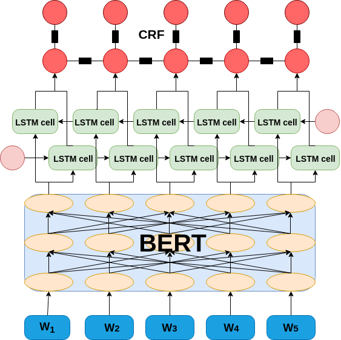
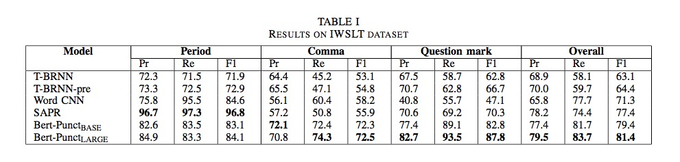

# bert_punct
Implementation of Punctuation Prediction on ASR text for English. We are using the pretrained BERT-embeddings for the task. On top of that we employ that the standard BiLSTM-CRF architecture that has been sucessfully applied to many NLP tasks. The implement is done using the estimator api of tensorflow. We achieve an overall F1 of 81.4 % on the joint prediction of period, comma and question mark.

## Dataset 
We are using the IWSLT 2012 dataset taken from the machine translation track. It can be downloaded from http://hltc.cs.ust.hk/iwslt/index.php/evaluation-campaign/ted-task.html 

## Packages
Ensure that tensorflow and bert-tensorflow packages are installed

## Pre-trained weights
Download the weights and vocabulary file for the uncased base version of BERT 

## Architecture

## For Deploying the model and Running the flask APP
Refer to [this](DEPLOY.md)

## Results

## References 
> Evaluation codes from https://github.com/guillaumegenthial/tf_metrics
> Pretrained BERT embeddings from https://github.com/google-research/bert
> https://github.com/macanv/BERT-BiLSTM-CRF-NER
> https://github.com/dsindex/etagger

